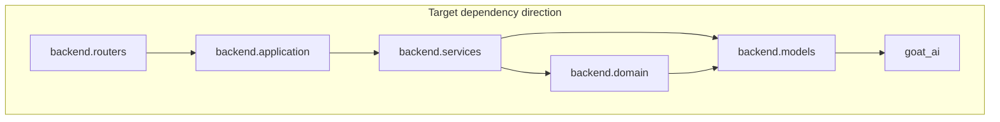

# Backend dependency graph

Import direction is enforced by `lint-imports` (`pyproject.toml` -> `importlinter`). First layer in the contract is outermost and may import inward only.

## Target (Phase 15.2+)

- `backend.domain` (Phase 15.1) holds policies and invariants.
- `backend.application` is use-case orchestration.
- `goat_ai` is the innermost shared library and does not import `backend`.

## Current (incremental)

As of Phase 15.9, `backend.application` owns all history, knowledge, media, system, model, upload, chat, and code-sandbox use cases. The graph above is the directional target, now fully applied to the history layer.

Wired routes:

- `GET /api/history` and `DELETE /api/history` flow through `backend.application.history`.
- `GET /api/history/{id}` flows through `backend.application.history.get_history_session_detail`.
- `DELETE /api/history/{id}` flows through `backend.application.history.delete_history_session` (Phase 15.9: moved from router directly calling `session_repository.delete_session()`).
- `POST /api/knowledge/*` flows through `backend.application.knowledge`.
- `POST /api/media/uploads` flows through `backend.application.media`.
- `GET /api/models` and `GET /api/models/capabilities` flow through `backend.application.models`.
- `GET /api/system/*` and `GET /api/ready` flow through `backend.application.system`.
- `POST /api/upload` and `POST /api/upload/analyze` flow through `backend.application.upload`.
- `POST /api/chat` uses `backend.application.chat` for request preflight before streaming.
- `POST /api/code-sandbox/exec` uses `backend.application.code_sandbox` for the feature gate.
- `backend.application.ports` is the shared contract face for `Settings`, `LLMClient`, `SessionRepository`, `ConversationLogger`, `TitleGenerator`, `SafeguardService`, `TabularContextExtractor`, and the stable shared exceptions; `backend.application.exceptions` keeps application-specific error classes.
- Routers and application modules should not import `backend.services.exceptions` or `backend.services.chat_capacity_service` directly.

## Related

- Port list: [PORTS.md](PORTS.md)
- Session JSON: [SESSION_SCHEMA.md](SESSION_SCHEMA.md)
- Import contract: `pyproject.toml` (`[tool.importlinter]`)
