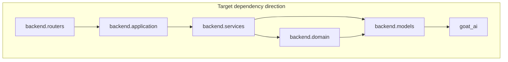

# Backend dependency graph

Import direction is enforced by **`lint-imports`** (`pyproject.toml` → `importlinter`). **First layer in the contract = outermost** (may import inward only).

## Target (Phase 15.2+)

- **`backend.domain`** (Phase 15.1) holds **policies and invariants** (safeguards, chart provenance, types)—not the same as an application “DDD domain” layer name collision; **`backend.application`** is use-case orchestration.
- **`goat_ai`** is the innermost shared library (no imports from `backend`).

## Current (incremental)

As of Phase 15.2c, **`backend.application`** exists with a **minimal** slice (e.g. history list delegation). Most routes still call services or dependencies directly; the graph above is the **directional target**, not a claim that every router is migrated.

**Partial wiring:** `GET /api/history` lists sessions via `backend.application.history.list_session_summaries` → `SessionRepository.list_sessions()`. Other history routes and features remain on their previous call paths until follow-up PRs.

## Related

- Port list: [PORTS.md](PORTS.md)
- Session JSON: [SESSION_SCHEMA.md](SESSION_SCHEMA.md)
- Import contract: `pyproject.toml` (`[tool.importlinter]`)
