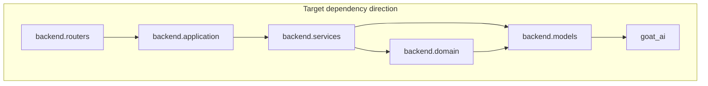

# Backend dependency graph

Import direction is enforced by `lint-imports` (`pyproject.toml` -> `importlinter`). First layer in the contract is outermost and may import inward only.

## Target (Phase 15.2+)

- `backend.domain` (Phase 15.1) holds policies and invariants.
- `backend.application` is use-case orchestration.
- `goat_ai` is the innermost shared library and does not import `backend`.

## Current (audited on main)

As of the Phase 15.9 closeout audit, `backend.application` owns all history, knowledge, media, system, model, upload, chat, artifact-download, and code-sandbox use cases. Routers are now thin HTTP adapters: they read request inputs and headers, resolve dependencies, call one application entrypoint, and map domain/application errors to HTTP responses.

Wired routes:

- `GET /api/history` and `DELETE /api/history` flow through `backend.application.history`.
- `GET /api/history/{session_id}` flows through `backend.application.history.get_history_session_detail`.
- `PATCH /api/history/{session_id}` flows through `backend.application.history.rename_history_session`.
- `DELETE /api/history/{session_id}` flows through `backend.application.history.delete_history_session` (Phase 15.9: moved from router directly calling `session_repository.delete_session()`).
- `POST /api/knowledge/*` flows through `backend.application.knowledge`.
- `POST /api/media/uploads` flows through `backend.application.media`.
- `GET /api/models` and `GET /api/models/capabilities` flow through `backend.application.models`.
- `GET /api/system/*` and `GET /api/ready` flow through `backend.application.system`.
- `POST /api/upload` and `POST /api/upload/analyze` flow through `backend.application.upload`.
- `POST /api/chat` uses `backend.application.chat` for request preflight before streaming.
- `GET /api/artifacts/{artifact_id}` flows through `backend.application.artifacts`.
- `POST /api/code-sandbox/exec` uses `backend.application.code_sandbox` for the feature gate.
- `backend.platform.http_security` remains a thin middleware adapter: it authenticates the credential, resolves `AuthorizationContext` via `backend.domain.credential_registry`, derives the rate-limit subject from request context, calls `backend.domain.rate_limit_policy.RateLimitPolicy`, and persists timestamps through `backend.services.rate_limit_store.InMemorySlidingWindowRateLimitStore`.
- Request-scoped auth types live in `backend.domain.authz_types`. Resource-level allow/deny checks are implemented in `backend.services.authorizer` and invoked from `backend.application.*` use cases and from services where needed; middleware does not make resource decisions. Import layer order is defined in `pyproject.toml` (`backend.platform.http_security` is listed above `backend.application` so middleware can depend on domain modules without violating the contract).
- `backend.application.ports` is the shared contract face for `Settings`, `LLMClient`, `SessionRepository`, `ConversationLogger`, `TitleGenerator`, `SafeguardService`, `TabularContextExtractor`, and the stable shared exceptions; `backend.application.exceptions` keeps application-specific error classes.
- Routers and application modules should not import `backend.services.exceptions` or `backend.services.chat_capacity_service` directly.

## Related

- Port list: [PORTS.md](PORTS.md)
- Session JSON: [SESSION_SCHEMA.md](SESSION_SCHEMA.md)
- Import contract: `pyproject.toml` (`[tool.importlinter]`)
